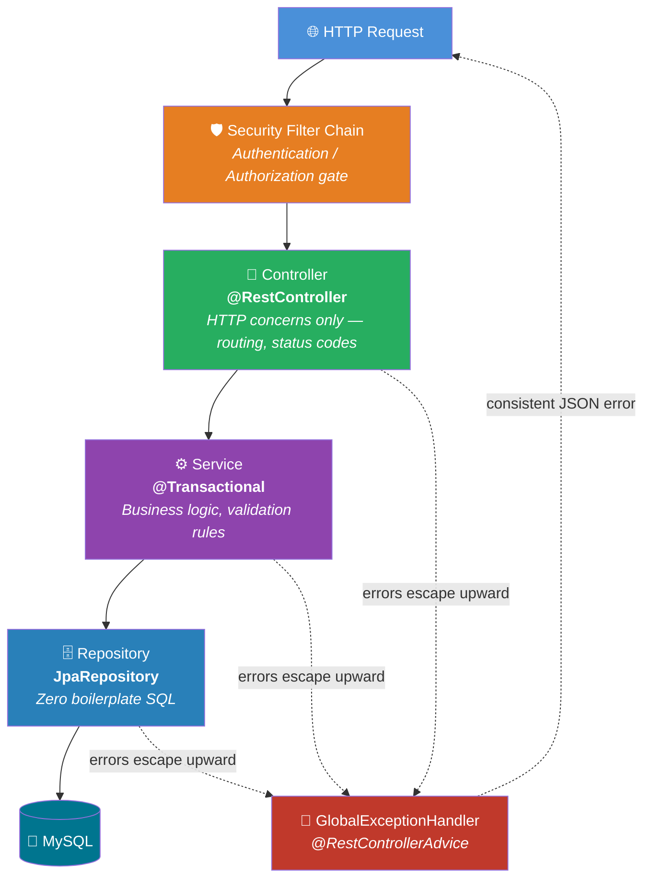

<div align="center">

# 🛒 ShopSphere

### A production-grade e-commerce backend built with Spring Boot

*Layered architecture • JWT-ready security • Clean REST API • Built incrementally, module by module*

[](https://openjdk.org/)
[](https://spring.io/projects/spring-boot)
[](https://www.mysql.com/)
[](https://maven.apache.org/)

</div>

<br>

## 📖 Overview

**ShopSphere** is a backend-first e-commerce platform built entirely from scratch to demonstrate real, defensible engineering decisions — not tutorial copy-paste. Every layer of this project follows the same discipline: **layered architecture, DTO isolation, centralized error handling, and security done properly**, with every design choice made deliberately and explained in the codebase's own history.

This project is being built module by module, with a clean, readable Git history — each commit represents one deliberate, working piece of functionality.

<br>

## ✨ What Makes This Project Different

| 🏗️ Real Architecture | 🔒 Real Security | 🧪 Interview-Ready |
|:---:|:---:|:---:|
| Controller → Service → Repository, never skipped, never mixed | BCrypt hashing, stateless auth, role-based access | Every decision has a documented trade-off |
| DTOs everywhere — entities never leak through the API | Centralized filter-chain based authorization | Clean commit history tells the build story |
| Global exception handling — consistent error contract | CSRF handled correctly for stateless APIs | No black boxes — everything is explained |

<br>

## 🧰 Tech Stack

<table>
<tr>
<td valign="top" width="50%">

**Core**
- ☕ Java 21 (LTS)
- 🍃 Spring Boot 3.x
- 📦 Maven
- 🐬 MySQL 8

**Persistence**
- Spring Data JPA / Hibernate
- Bidirectional entity relationships
- `@Transactional` transaction management

</td>
<td valign="top" width="50%">

**Security**
- Spring Security
- BCrypt password hashing
- Stateless, JWT-based authentication *(in progress)*
- Role-based authorization (`USER` / `ADMIN`)

**API Quality**
- Bean Validation (Jakarta Validation)
- Centralized `@RestControllerAdvice` error handling
- Consistent JSON error contract

</td>
</tr>
</table>

<br>

## 🏛️ Architecture



**Why this shape?** Each layer has exactly one reason to change — swap MySQL for PostgreSQL and only the Repository layer notices; add a validation rule and only the Service layer notices; move from REST to GraphQL and only the Controller layer notices. This is the Single Responsibility Principle applied concretely, not as a slide in a textbook.

<br>

## 📂 Project Structure

```
backend/
└── src/main/java/com/shopsphere/backend/
    ├── entity/           # JPA entities — Product, Category, User, Role
    ├── repository/        # Spring Data JPA interfaces
    ├── dto/               # API-facing request/response shapes
    ├── mapper/            # Entity ↔ DTO conversion
    ├── service/           # Business logic, transaction boundaries
    ├── controller/        # REST endpoints
    ├── exception/         # Custom exceptions + global handler
    └── config/            # Spring Security configuration
```

<br>

## 🚀 Features Implemented So Far

- [x] **Product & Category domain model** — bidirectional `@OneToMany` / `@ManyToOne`, lazy loading done correctly, cascade rules deliberately chosen
- [x] **Full CRUD for Products & Categories** — with a real business rule (categories with existing products can't be deleted — `409 Conflict`, not a silent cascade)
- [x] **DTO + Mapper pattern** — entities never serialize directly over the wire, preventing recursion bugs and lazy-loading exceptions
- [x] **Bean Validation** — declarative constraints (`@NotBlank`, `@Size`, `@Pattern`, `@DecimalMin`) with custom messages
- [x] **Centralized exception handling** — every error, from validation failures to business-rule conflicts, returns a consistent JSON shape with the correct HTTP status
- [x] **User registration** — BCrypt password hashing, duplicate username/email protection, zero path for privilege escalation through signup
- [x] **Spring Security filter chain** — configured explicitly, public vs. protected routes declared deliberately
- [ ] JWT-based login & stateless authentication *(in progress)*
- [ ] Role-based endpoint authorization (`USER` vs `ADMIN`)
- [ ] Flyway migrations (replacing `ddl-auto=update`)
- [ ] Pagination, filtering, and sorting
- [ ] Testing suite (JUnit + Mockito + Testcontainers)
- [ ] Dockerized deployment + CI pipeline

<br>

## 🔍 Design Decisions Worth Knowing

> A few deliberate trade-offs made along the way — the kind of thing worth being able to explain in an interview, not just implement.

| Decision | Why |
|---|---|
| **DTOs instead of exposing entities** | Prevents infinite recursion on bidirectional relationships, avoids `LazyInitializationException`, and decouples the API contract from internal schema changes |
| **`FetchType.LAZY` on `@ManyToOne`** | Overrides JPA's default `EAGER` — a widely-regarded spec mistake — to avoid unnecessary joins and N+1 risk |
| **Blocking category deletion instead of cascading** | A category with active products shouldn't silently wipe inventory — the business rule lives explicitly in the Service layer |
| **`EnumType.STRING` for roles, not `ORDINAL`** | Reordering enum constants would silently corrupt ordinal-based data in production — string storage is self-documenting and safe |
| **Constructor injection over field injection** | Enables immutable (`final`) dependencies and trivial unit testing without a Spring context |
| **CSRF disabled** | Correct and standard for stateless, token-based APIs — CSRF protects cookie-based auth, which this project doesn't use |

<br>

## ⚙️ Getting Started

### Prerequisites
- Java 21+
- Maven 3.9+
- MySQL 8+

### Setup

```bash
# Clone the repository
git clone <your-repo-url>
cd shopsphere-ecommerce/backend

# Create the database
mysql -u root -p -e "CREATE DATABASE shopsphere_db;"

# Configure your credentials in application.properties
# spring.datasource.username=root
# spring.datasource.password=your_password

# Run it
./mvnw spring-boot:run
```

The API will be live at `http://localhost:8080`.

<br>

## 📡 API Reference (so far)

<details>
<summary><b>🛍️ Products</b></summary>
<br>

| Method | Endpoint | Description |
|---|---|---|
| `GET` | `/api/products` | List all products |
| `GET` | `/api/products/{id}` | Get a single product |
| `POST` | `/api/products` | Create a product |

</details>

<details>
<summary><b>🗂️ Categories</b></summary>
<br>

| Method | Endpoint | Description |
|---|---|---|
| `GET` | `/api/categories` | List all categories |
| `GET` | `/api/categories/{id}` | Get a single category |
| `POST` | `/api/categories` | Create a category |
| `DELETE` | `/api/categories/{id}` | Delete a category — `409` if products still reference it |

</details>

<details>
<summary><b>🔐 Auth</b></summary>
<br>

| Method | Endpoint | Description |
|---|---|---|
| `POST` | `/api/auth/register` | Register a new user (password hashed with BCrypt) |
| `POST` | `/api/auth/login` | *(coming soon — JWT issuance)* |

</details>

**Example error response** — every failure across the entire API follows this same shape:

```json
{
  "status": 404,
  "message": "Product not found with id: 99",
  "timestamp": "2026-07-31T12:00:00",
  "path": "/api/products/99",
  "errors": null
}
```

<br>

## 🗺️ Roadmap

```
✅ Foundations & domain modeling
✅ Persistence & MySQL integration
✅ Validation & centralized error handling
🔄 Security — JWT auth & role-based access      ← currently here
⬜ Business logic — cart, orders, inventory
⬜ Production concerns — testing, docs, caching
⬜ Deployment — Docker, CI/CD
```

<br>

---

<div align="center">

Built incrementally, one deliberate module at a time.

</div>